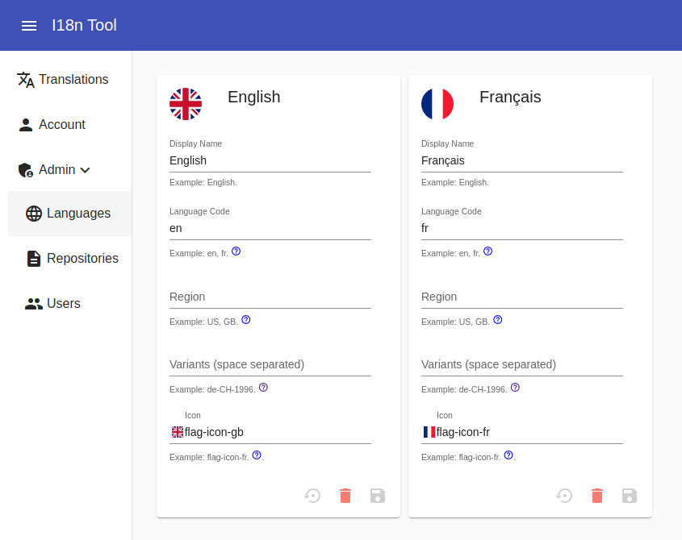
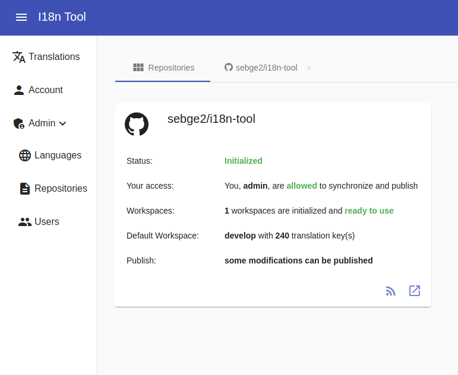
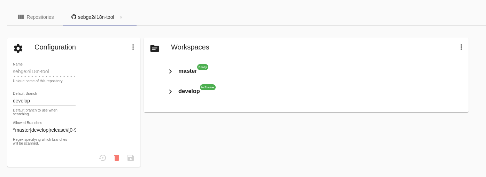
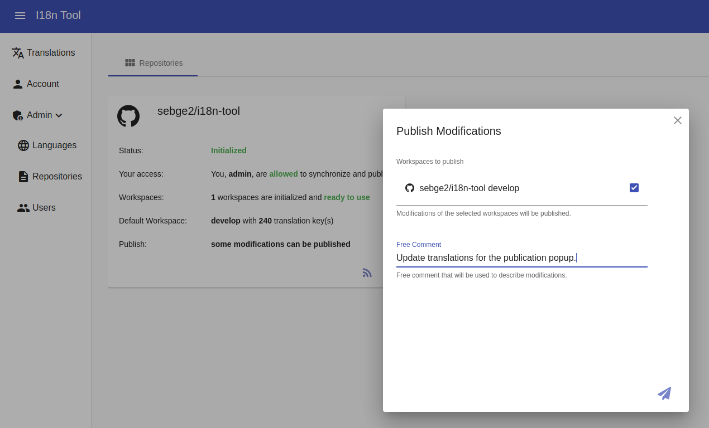
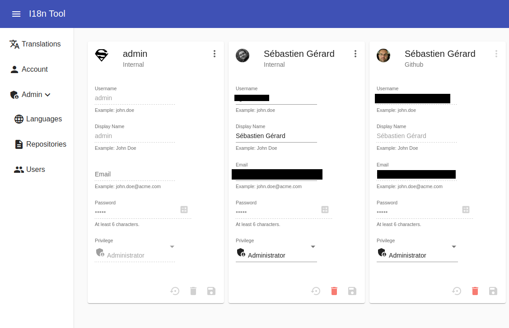

[link=https://travis-ci.com/sebge2/i18n-tool]
image::https://img.shields.io/travis/sebge2/i18n-tool/master.svg?label=master[Build Status]

= I18n Tool
This tool aims to make a bridge between programmers and translators. Translators are able to find translations defined by developers via a user-friendly UI.

The tool is able to checkout Git(Hub) repositories, find translations bundles and exposes them to (human) translators.

== Features
* Checkout public/private Git/GitHub repositories
* Find translation bundles written in JSON JCU or Properties formats
* Distinguish Administrator/Normal users
* Commit, push and create pull-requests with new translations
* OAuth support (Google and GitHub)
* Internal users (not authenticated via OAuth)

== Why?

As a technical developer, I wanted to create a useful project which will also be an opportunity
for me to investigate up-to-date technologies and implement them.

When I searched a translation solution for my company, I didn't find anything full-filling our need.

Starting a project from scratch helped me to:

* Play with Java 11.
* Play with Spring 5 & Boot 2.
* Learn Angular 8/9:
   ** How to structure code? tests?
   ** How to test with: Karma, Jasmine and Protractor?
   ** i18n in Angular.
   ** Websocket.
   ** Server-Sent-Event.
* How to create a Spring Docker App?
* Learn how to Git(Hub) in Java.
* How to develop a webhook?
* How to create an OAuth2 client with Spring?
* How to have a continuous integration and deployment?
   ** Try the platform link:https://www.travis-ci.com[Travis-CI.com]
* Discover Junit 5.
* Learn reactive programming on backend side with Reactor.

== Presentation

=== Login
The user's journey starts with the login page. Every user must be authenticated. The user must be authenticated:

* externally by GitHub: it's optional, allowed users can be restricted based on their GitHub Organization,
* externally or Google: it's optional, allowed users can be restricted based on the domain,
* internally by the application.

Users of the two first groups are *external users* while the latest group is composed of *internal users*.

[link=./doc/login-screen.png]
image::./doc/login-screen.png[Login Screen,150]

An administrator user "_admin_" is automatically created.
Its password can be either auto-generated (and printed out in the console),
or specified with the environment variable _DEFAULT_ADMIN_PASSWORD_.

=== Locales

First of all, let's setup locales supported by your application. The tool considers that you need a translation for all the configured locales. When pushing missing translations, the tool is able to create missing translation files on itself.

Language, region and variants are supported, cfr link:https://tools.ietf.org/html/bcp47#section-2.2.5[BCP-47].
[link=./doc/locales-management.png]

=== Repositories
A repository is a service storing your project files. Two types are
supported: Git and GitHub. Git repositories are accessed by using
credentials of the current user. While GitHub repositories can be
accessed by an access-key, or by a user authenticated with GitHub OAuth.

[link=./doc/repositories-management-list.png]

The tool uses a local copy of your repository and supports multiple branches.
Every branch is associated to a _workspace_. Every time, a translation
is updated, the workspace is updated, but changes are not directly
committed and pushed to the repository.

Once you are ready, all modifications made so far, can be published to
the repository (you can edit translations on multiple workspaces at
the same time). For Git repositories, modifications are pushed directly
to associated branches. For GitHub repositories, modifications are pushed
in dedicated branches and pull-requests are opened.

[link=./doc/repositories-management-view.png]

=== Translation Bundle File Formats
This tool supports the following translation bundle formats:

* Java properties file
* JSON with http://userguide.icu-project.org/formatparse/messages[ICU Format]

Those are the typical formats used by Java and Angular applications.

=== Searching
When opening the _Translations_ screen, the searcher is initialized to
search for missing translations in the user's languages for all the
default workspace of repositories.

[link=./doc/translations-search-screen.png]
image::./doc/translations-search-screen.png[Translations Search Screen,300]

It's also possible to search for all translations, or all translations that have been
updated by the current user (or not only by himself).

[link=./doc/translations-screen.png]
image::./doc/translations-screen.png[Translations Screen,300]

Later, modifications can be published at the moment you decide.
The publication can be performed on several workspaces at the same
time.

[link=./doc/translations-publication.png]

=== Users Management
Users can be created directly on the tool, _internal users_.

You can use OAuth to authenticated GitHub users. For that, you have to enable
the Spring profile "github" and either provide environment variables
contained in that file, or provide your own _application-github.yml_ file.
As you may notice in the pre-defined file, you can restrict users based
on the Organization that they belong to, or based on the domain of their
email addresses.

You can also use Google OAuth to authenticate user. The Spring profile is
"google". In the same ways as for GitHub, you can provide environment
variables, or provide your own _application-google.yml_ file. Allowed
users can be restricted via the domain of their email addresses.

[link=./doc/users-management.png]

