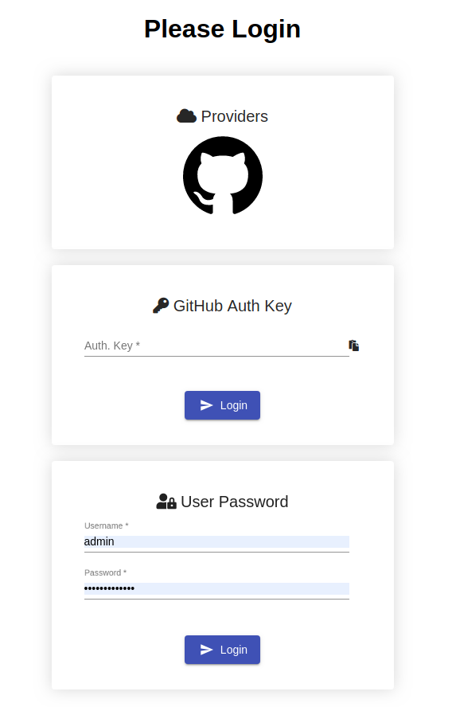
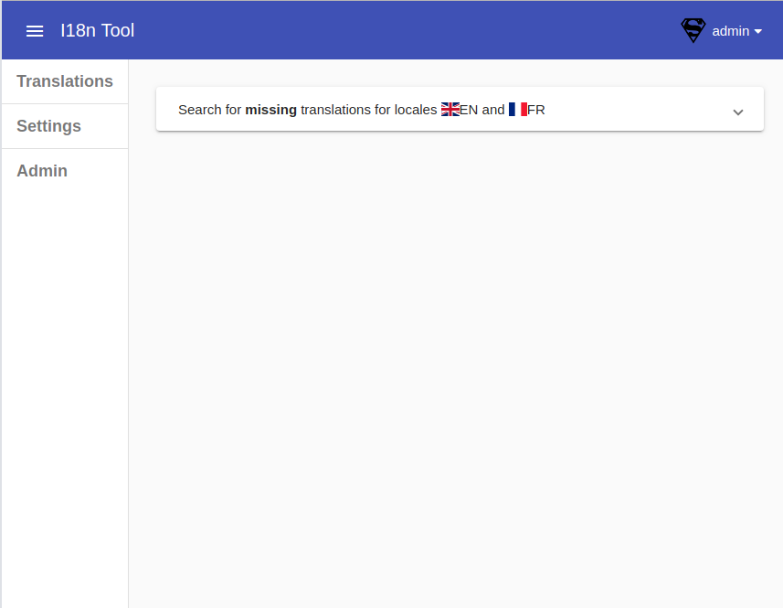
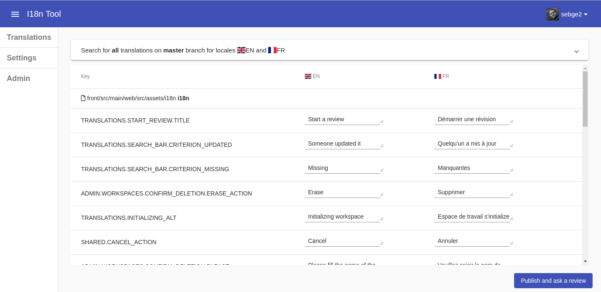
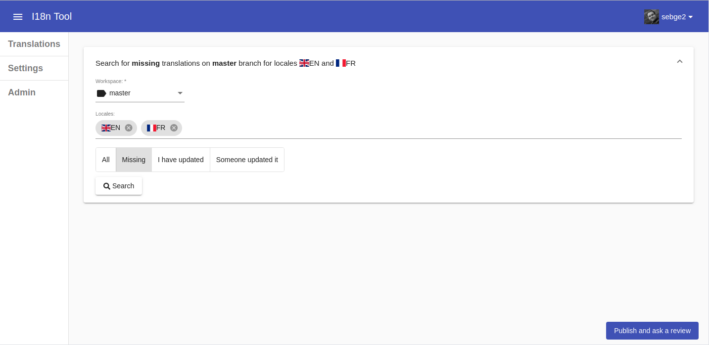
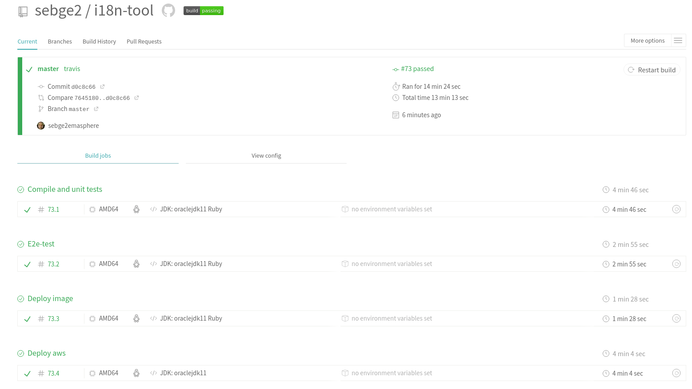

[link=https://travis-ci.org/sebge2/i18n-tool]
image::https://travis-ci.org/sebge2/i18n-tool.svg?branch=master[Build Status]

= I18n Tool
Tool scanning translation bundles in a GitHub repository. A UI editor allows to find (missing) translations and fill them.

== What is It?
* Web App scanning translation files of a GitHub repository
* UI for editing translations files
* Commit & push modified translations

== Why?

* No existing solution on the market
* Investigating up-to-date technologies: 
    ** Java 11+
    ** Spring 5 & Boot 2
    ** Angular 8:
        *** How to do testing with: Karma, Jasmine and Protractor
        *** How to structure code? and tests?
        *** i18n in Angular
        *** Websocket
    ** How to create a Spring Docker App
    ** Java integration with Git(Hub)
    ** How to develop a webhook?
    ** How to create an OAuth2 client with Spring?
    ** How to have a continuous integration and deployment?
        * Travis-CI.com
    ** Remaining:
        *** Junit 5
        *** Reactive programming on backend side
* Start a project from scratch

== Presentation

The startup page is the login page. Every user must be authenticated.
The external user must be part of the organization.

[link=./doc/login-screen.png]

An administrator user "_admin_" is automatically created.
Its password can be either auto-generated (and printed out on the console),
or specified with the environment variable _DEFAULT_ADMIN_PASSWORD_.

User can also use their GitHub account to log on the application. Only users allowed to access to the
repository are allowed.

Authenticating with "auth-key" is mainly used for automated testing.
The associated user must be able to access the current repository.

[link=./doc/main-screen-admin.png]

The default section is "translations" allowing to search and translate keys.
By default, the searcher looks for missing translations in users' languages.

[link=./doc/translations-screen.png]

It's also possible to search for all translations, translations that have been updated
by the current user (or not only by himself). A workspace is the current
edition of a Git Branch. By default, the "master" workspace is used.

Once all translations of a workspace have been filled, it
can be reviewed. A pull-request is generated with all the changes.

Once the pull-request and the associated branch is closed/merged, the workspace
is deleted. A new workspace based on the Git branch can be created later on.

[link=./doc/translations-search-screen.png]

== Environment Setup
=== Travis Configuration

The following environment variables are needed by this Travis-CI build:

* AWS_ACCESS_KEY=   **
* AWS_SECRET_KEY=**
* AWS_BUCKET_NAME=**
* DOCKER_PASSWORD=**
* DOCKER_USERNAME=**
* E2E_SERVER_PORT=8080
* E2E_GIT_HUB_AUTH_TOKEN=**

There are 4 jobs:

. Build of front and back including unit tests. The docker image is build as a candidate.
. E2E tests. The application is launched in the building container.
. The docker image is deployed in the image registry. The candidate image is tagged as the final one.
. The application is deployed

[link=./doc/travis-ci.png]

=== Amazon EB Configuration

The following environment variables must be setup on Amazon Elastic Bean Stalk:

* SERVER_PORT
* DOCKER_IMAGE_VERSION
* GIT_HUB_OAUTH_CLIENT
* GIT_HUB_OAUTH_SECRET
* GIT_HUB_REPO_USER_NAME
* GIT_HUB_REPO_NAME
* GIT_HUB_WEBHOOK_SECRET
* DEFAULT_ADMIN_PASSWORD (optional)

The EB environment must use an IAM role allowing to attach an EC2 volume.
Either modify the existing role _aws-elasticbeanstalk-ec2-service-role_, or create a dedicated role. https://docs.aws.amazon.com/IAM/latest/UserGuide/reference_policies_examples_ec2_volumes-instance.html[AWS DOcumentation]

== Technical Documentation
=== Backend Endpoints

* /api/*
* /ws/*
* /auth/*
    * /auth/oauth2/authorize-client/{client-registration-id}
    * /auth/oauth2/code/{code}
    
=== Angular Routes

* /login
* /logout/success